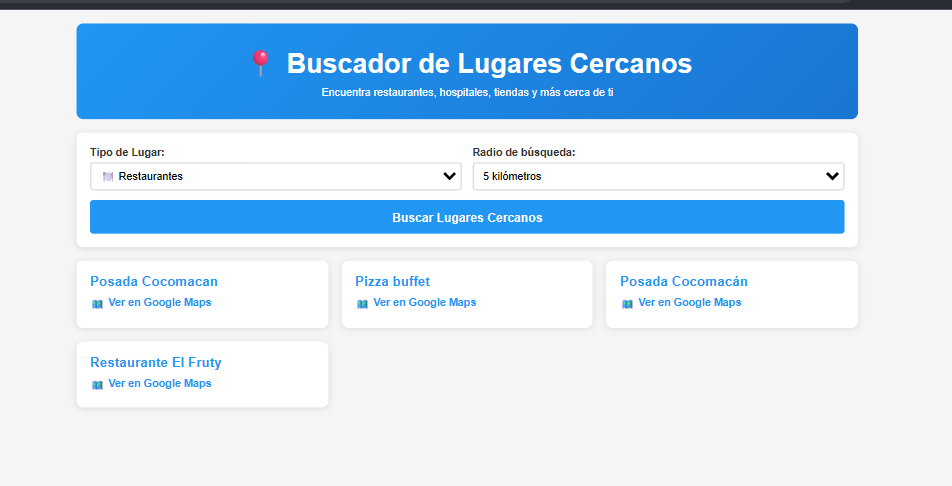
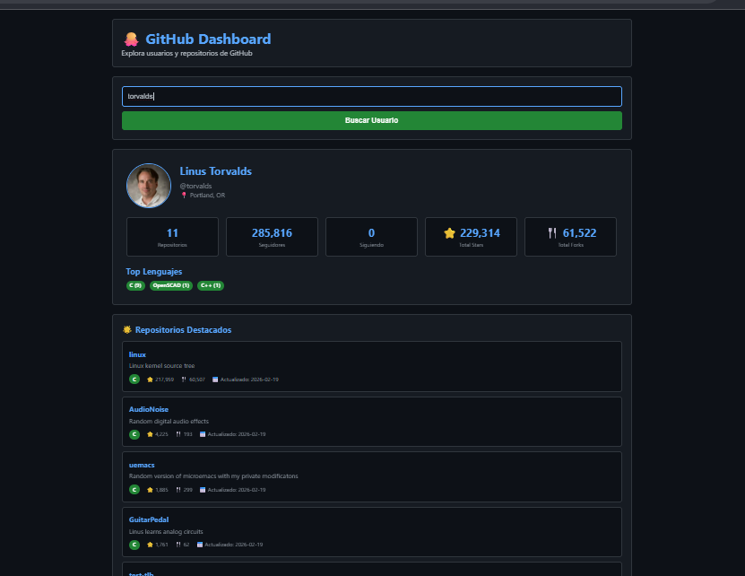
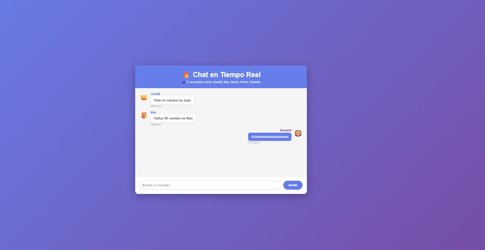
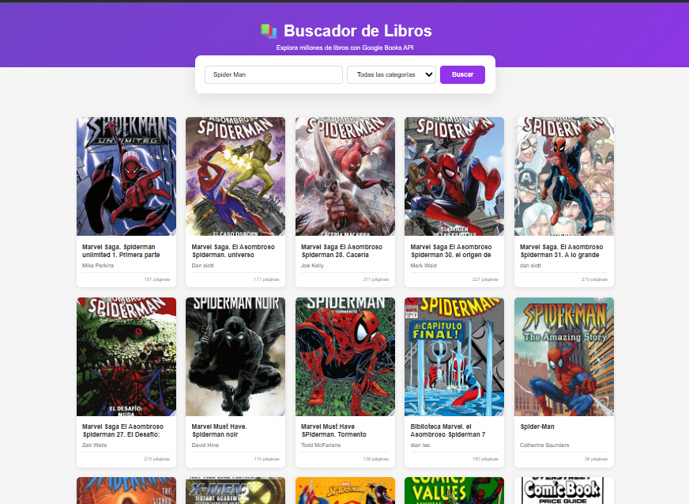
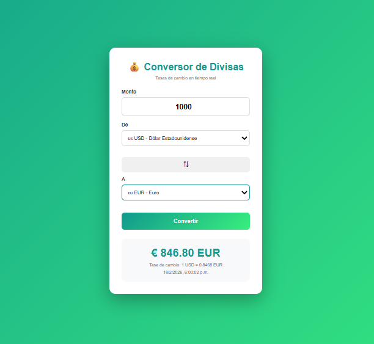
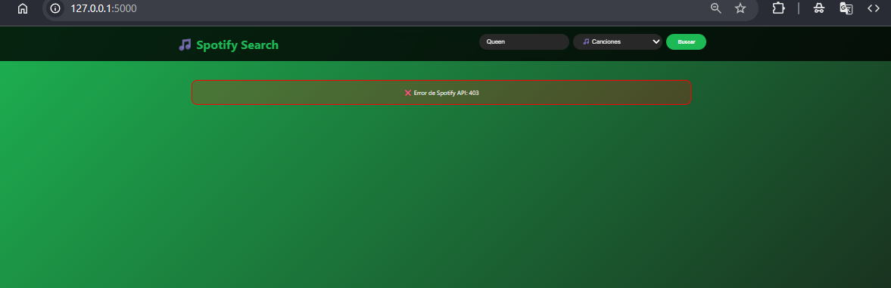

# Portafolio de Consumo de APIs
---

## 1. Aplicación del Clima

## 2. Buscador de Lugares

## 3. Analizador de Reddit

## 4. Dashboard de GitHub

## 5. API REST - Gestión de Productos (SQLite)

## 6. Chat en Tiempo Real (Firebase)

## 7. Buscador de Libros (Google Books API)

## 8. Conversor de Divisas (ExchangeRate API)

## 9. Buscador de Películas (TMDB API)

## 10. Buscador de Música (Spotify Web API)

---
